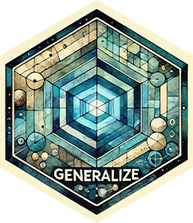

# Generalize 

**Author:** [Ludvig R. Olsen](https://www.ludvigolsen.dk/) ( <r-pkgs@ludvigolsen.dk> )

The ultimate goal of training machine learning models is to generalize to new, unseen data. This package contains tools for measuring model performance across multiple datasets via cross-dataset-validation (aka. leave-one-dataset-out).

Under development!

 - Relies on an old version of scikit-learn
 - Regression is not currently working